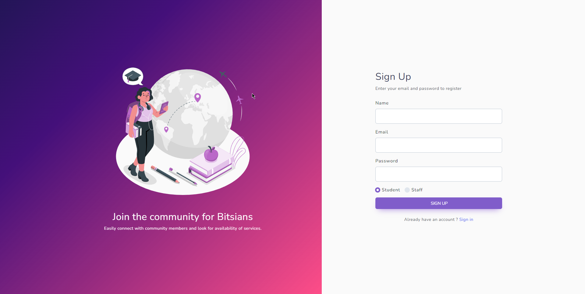
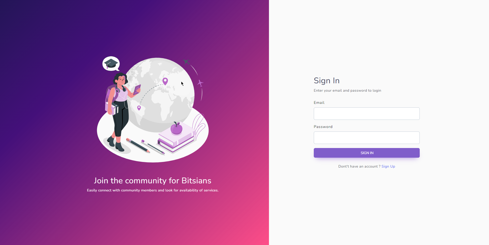
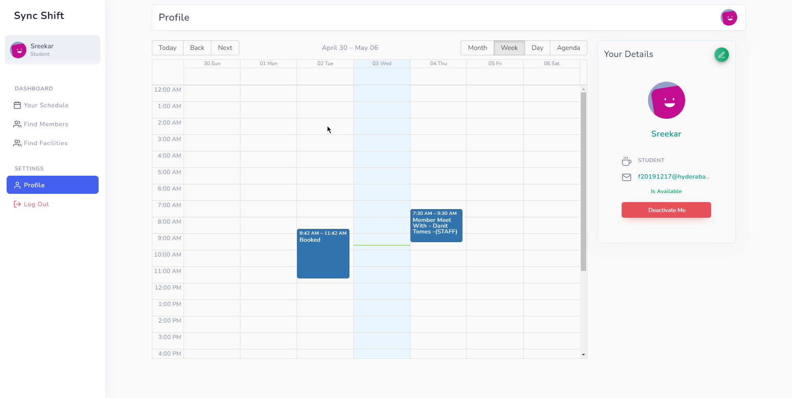
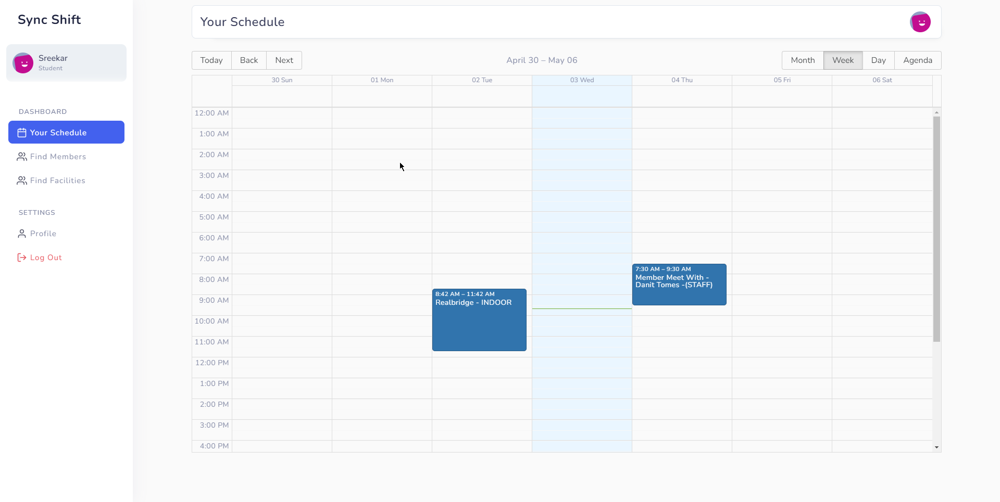
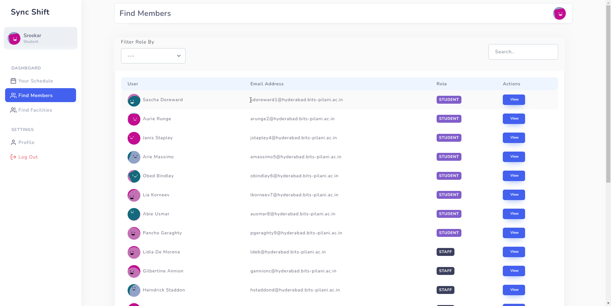
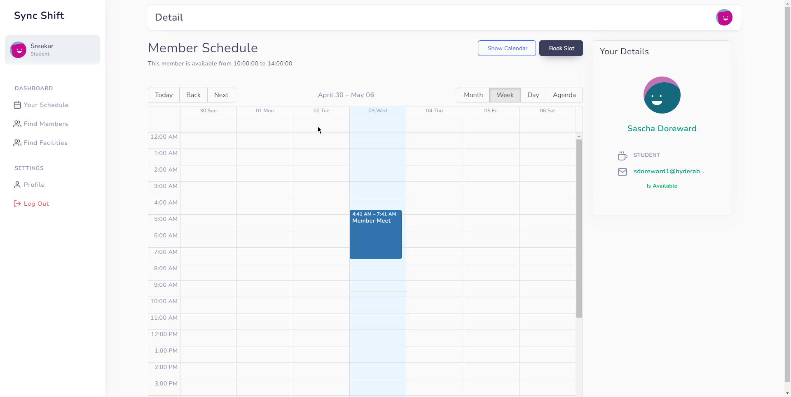

# Sync Shift (Web)
This is a project made with React and Typescript for the BITS Pilani Course - Object Oriented Programming. The project is a web application for scheduling slots for BITS Pilani students, staff and booking facilities. Backend is made with Java and Spring Boot and can be found [here]()

<br />

## Getting Started

Make sure you have [node.js](https://nodejs.org) and [yarn](https://yarnpkg.com/) installed on your system. Then run the following commands in the root directory of the project.

```bash
yarn install
yarn dev
```

<br />

## Problem Statement

Assume that you are required to develop a scheduler application for BITS community members
(student and staff) based on their availability. Members can register as staff/ student roles using
their BITS email ID. The application will have a sign-in page, from where members can register.
Registered members can log in via login page with BITS email and password set during
registration. After logging into the application members can look for the availability of other
community members and facilities. Members can also set their availability.


<br />

## Gallery

#### Sign Up

#### Sign In

#### My Profile

#### My Schedule

#### Members List

#### Member Profile



<br />

## Technologies Used
1. [React](https://react.dev)
2. [Typescript](https://typescriptlang.org)
3. [Tanstack Query + Table](https://tanstack.com)
4. [React Router](https://reactrouter.com)
5. [React Hook Form](https://react-hook-form.com)
6. [Bootstrap 5](https://getbootstrap.com)
